# Lab 9

## Docker Example 0

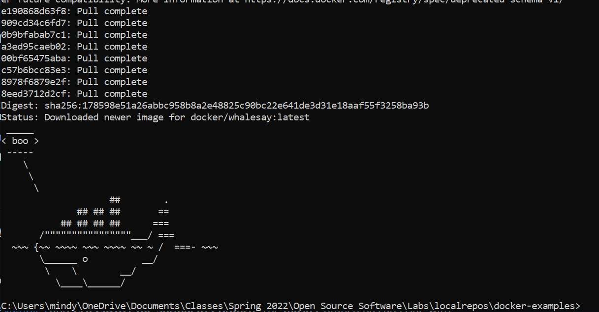

I started a docker container and ran the code with the cowsay command.

## Docker Example 1

### Running the Ubuntu Container

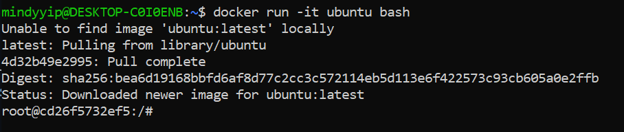

I ran the docker command to create an ubuntu container.

### Installing VIM

I ran apt update and installed vim. I also created and placed a test file in the /root directory.

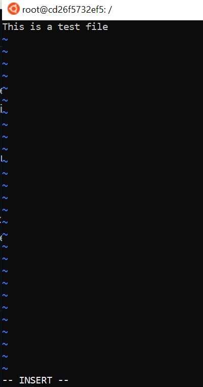

### Installing Cowsay

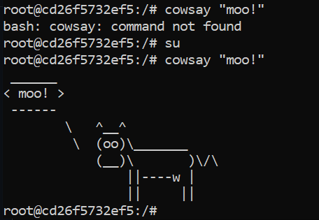

## Docker Example 2

### Seeing rocket chat browser in Docker Desktop

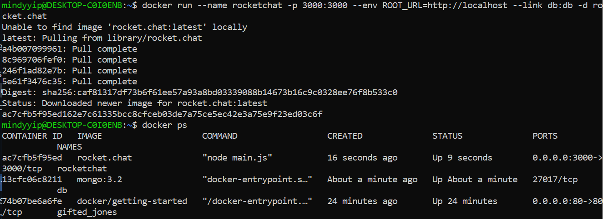

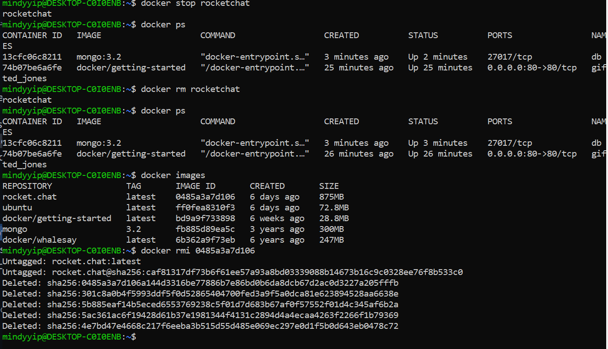

## Docker Example 3

### Running the container and opening the port

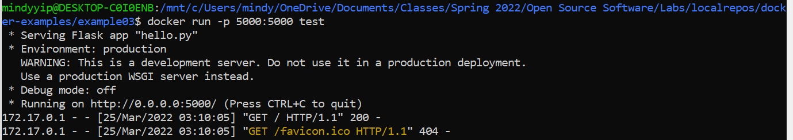

### Seeing the hello world example

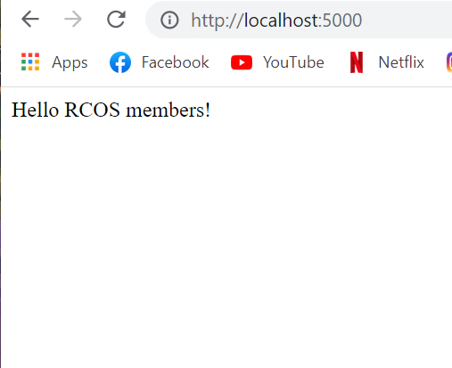

## Docker Example 4

### Build docker-compose

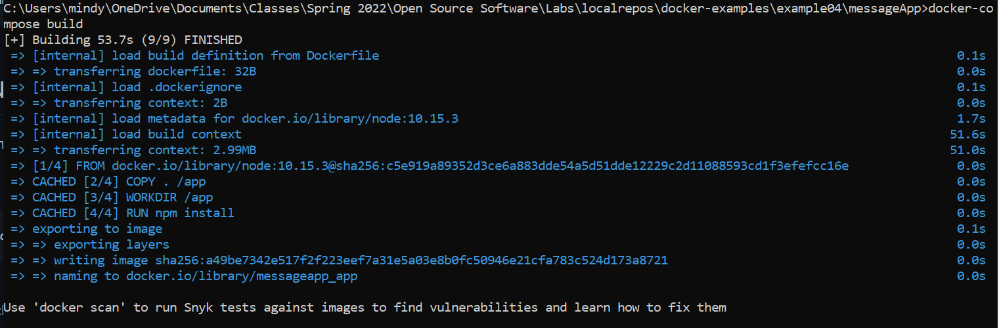

### Running the services

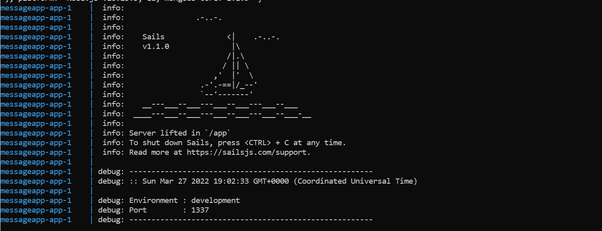

### Getting the list of current messages

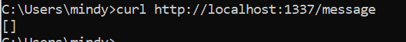

### Creating a message

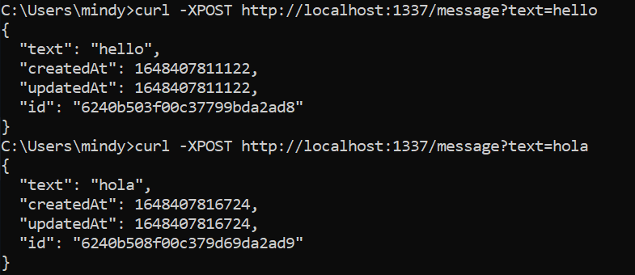

### Getting a message

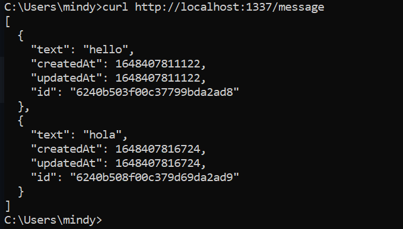

### Modifying a message

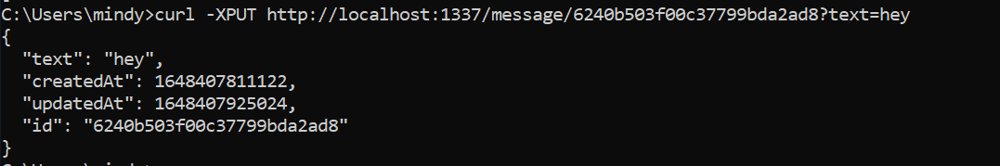

### Deleting a message

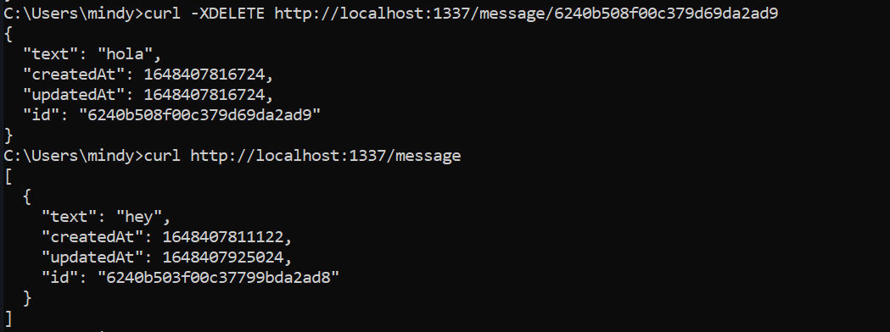

