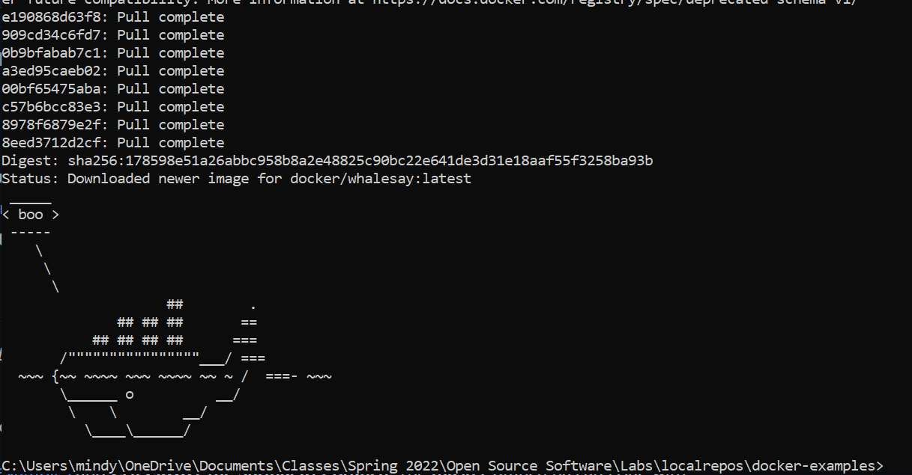
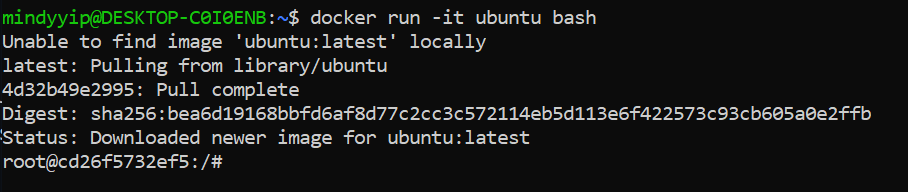
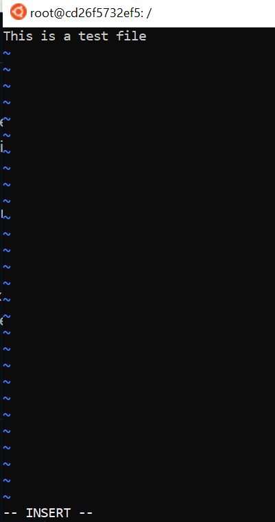
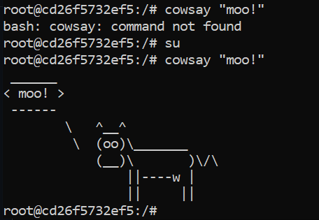
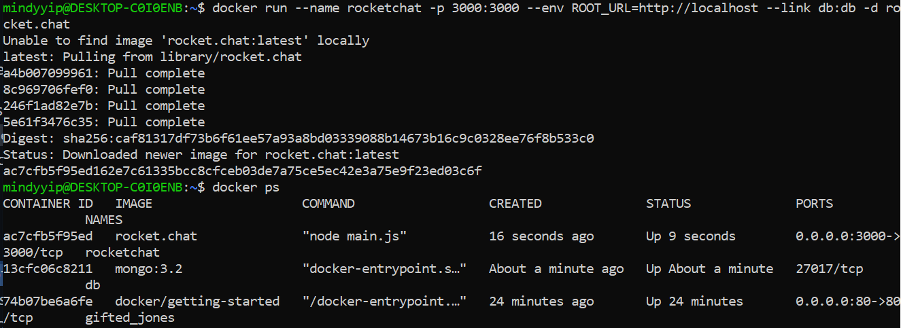
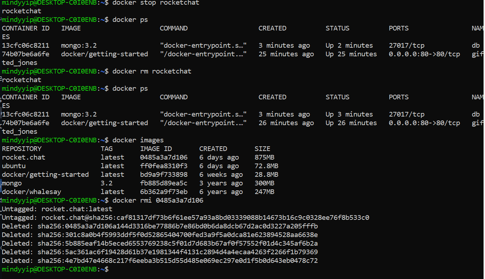
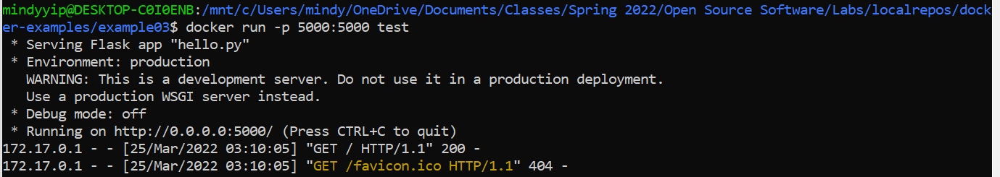
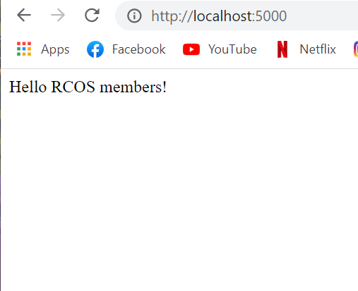

# Lab 9

## Docker Example 0

I started a docker container and ran the code with the cowsay command.

## Docker Example 1

### Running the Ubuntu Container

I ran the docker command to create an ubuntu container.

### Installing VIM

I ran apt update and installed vim. I also created and placed a test file in the /root directory.

### Installing Cowsay

## Docker Example 2

## Docker Example 3

## Docker Example 4

